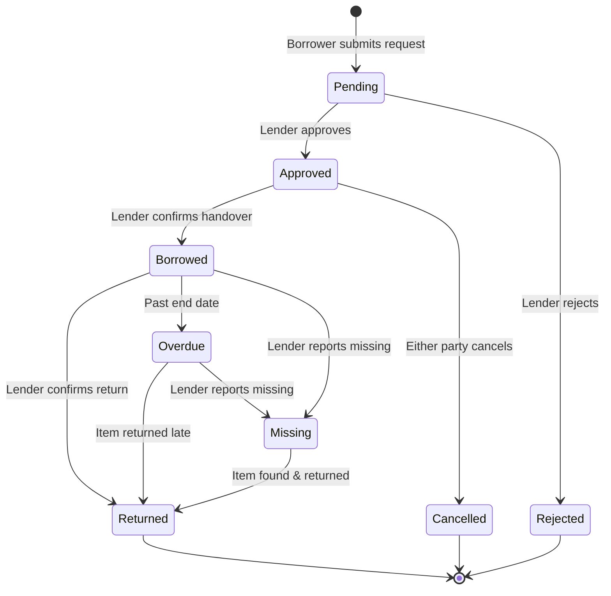

<p align="center">
  
  
  
  
  
</p>

# 🎓 UniShare — Student Item Sharing Platform

**UniShare** is a web-based platform that allows university students to **borrow and lend items** using a **virtual point-based economy** — no real money involved. Built as a Final Year Project (FYP) for a Diploma in Computer Science.

> Students earn points by lending their items and spend points to borrow from others, creating a self-sustaining campus sharing ecosystem.

---

## ✨ Features

### 🔐 Authentication & User Management
- User registration and login with secure password hashing
- User profiles with avatar, bio, location, and phone number
- Admin role with elevated privileges
- Account suspension system with reason tracking

### 📦 Item Management
- List items for lending with title, category, condition, and description
- Set custom points-per-day pricing and maximum borrow duration
- Upload multiple photos per item with primary photo selection
- Toggle item availability (active/inactive)
- Item likes/favorites system

### 🤝 Borrowing System
- Submit borrow requests with start/end dates and optional notes
- Full status lifecycle: `Pending → Approved → Borrowed → Returned`
- Overlap detection to prevent double-booking
- Automatic point calculation based on borrow duration
- Support for cancellation, rejection, and overdue tracking

### 💰 Virtual Point Economy
- Every new user starts with a points balance
- Points are **spent** when borrowing items
- Points are **earned** when lending items
- Complete transaction history with descriptions
- Atomic, race-condition-safe point transfers using database locks

### ⚠️ Penalty System
- **Late Return** — 5 points per overdue day
- **Damaged Item** — Flat 50-point penalty
- **Missing Item** — 3× the total borrow cost
- Lenders can report damage/missing with evidence photos
- Admin review workflow: Pending → Approved / Rejected

### ⭐ Ratings & Reviews
- Both borrowers and lenders can rate each other after a transaction
- Item-level reviews with star ratings
- User reputation via average rating display

### 💬 Messaging
- Real-time conversations between users
- Unread message count tracking
- Start conversations directly from item listings

### 🛡️ Admin Dashboard
- Platform-wide statistics and analytics
- User management (view, suspend/unsuspend, toggle admin, adjust points)
- Item moderation (toggle status, delete)
- Borrow request oversight
- Penalty review and approval workflow
- Reporting and data export

---

## 🏗️ Tech Stack

| Layer          | Technology                                                  |
|----------------|-------------------------------------------------------------|
| **Framework**  | [Laravel 12](https://laravel.com)                           |
| **Language**   | PHP 8.2+                                                    |
| **Frontend**   | [Blade Templates](https://laravel.com/docs/blade) + Vanilla JS |
| **Styling**    | [Tailwind CSS 4](https://tailwindcss.com)                   |
| **Build Tool** | [Vite 7](https://vitejs.dev) with Laravel Vite Plugin       |
| **Database**   | SQLite (default) / MySQL compatible                         |
| **Queue**      | Database driver                                             |
| **Cache**      | Database driver                                             |
| **HTTP Client**| [Axios](https://axios-http.com)                             |

---

## 📐 Architecture

```
unishare/
├── app/
│   ├── Http/
│   │   ├── Controllers/        # 8 controllers (Auth, Item, BorrowRequest, etc.)
│   │   └── Middleware/          # AdminMiddleware for role-based access
│   ├── Models/                  # 10 Eloquent models
│   │   ├── User.php             # Users with points, ratings, admin/suspend flags
│   │   ├── Item.php             # Lendable items with photos and reviews
│   │   ├── BorrowRequest.php    # Full lifecycle state machine
│   │   ├── Penalty.php          # Late/damage/missing penalty tracking
│   │   ├── PointTransaction.php # Audit log for all point movements
│   │   ├── Conversation.php     # Messaging conversations
│   │   ├── Message.php          # Individual messages
│   │   ├── Rating.php           # User-to-user ratings
│   │   ├── Review.php           # Item reviews
│   │   └── ItemPhoto.php        # Multi-photo uploads
│   ├── Providers/               # Service providers
│   └── Services/
│       └── PointService.php     # Atomic point add/spend with DB locks
├── database/
│   ├── migrations/              # 19 migration files
│   └── seeders/                 # DatabaseSeeder + PenaltyDemoSeeder
├── resources/
│   └── views/                   # Blade templates
│       ├── layouts/             # App layout
│       ├── admin/               # Admin dashboard views
│       ├── auth/                # Login & registration
│       ├── borrow/              # Borrow request management
│       ├── items/               # Item CRUD views
│       ├── messages/            # Messaging UI
│       ├── penalties/           # Penalty views
│       ├── profile/             # User profile
│       └── ratings/             # Rating & review forms
├── routes/
│   └── web.php                  # All web routes (auth, items, borrow, admin)
├── docs/                        # Project documentation
│   ├── data_dictionary.md       # Database field reference
│   ├── user_manual.md           # End-user guide
│   └── testing.md               # Test cases & results
└── public/                      # Web root & compiled assets
```

---

## 🗃️ Database Schema

The application uses **19 migrations** to build the following key tables:

| Table                 | Purpose                                           |
|-----------------------|---------------------------------------------------|
| `users`               | User accounts, points balance, admin/suspend flags |
| `items`               | Lendable items with pricing and availability       |
| `item_photos`         | Multi-photo support per item                       |
| `borrow_requests`     | Borrow transactions with full status lifecycle     |
| `point_transactions`  | Audit log for every point earn/spend               |
| `penalties`           | Late return, damage, and missing item penalties    |
| `ratings`             | User-to-user ratings per borrow transaction        |
| `reviews`             | Item reviews with star ratings                     |
| `conversations`       | Two-party messaging threads                        |
| `messages`            | Individual messages with read tracking             |
| `user_item_likes`     | Pivot table for item favorites                     |

---

## 🚀 Getting Started

### Prerequisites

- **PHP** 8.2 or higher
- **Composer** 2.x
- **Node.js** 18+ and **npm**
- **SQLite** (default) or **MySQL 8+**

### Installation

1. **Clone the repository**
   ```bash
   git clone https://github.com/Ariffahmy/unishare.git
   cd unishare
   ```

2. **Quick setup** (installs dependencies, generates key, runs migrations, and builds assets)
   ```bash
   composer setup
   ```

   <details>
   <summary>Or set up manually step by step</summary>

   ```bash
   # Install PHP dependencies
   composer install

   # Copy environment config
   cp .env.example .env

   # Generate application key
   php artisan key:generate

   # Run database migrations
   php artisan migrate

   # Install Node dependencies
   npm install

   # Build frontend assets
   npm run build
   ```
   </details>

3. **Configure your environment** — Edit `.env` as needed:
   ```env
   APP_NAME=UniShare
   APP_URL=http://localhost:8000

   # Default: SQLite (no extra setup needed)
   DB_CONNECTION=sqlite

   # For MySQL, uncomment and set:
   # DB_CONNECTION=mysql
   # DB_HOST=127.0.0.1
   # DB_PORT=3306
   # DB_DATABASE=unishare
   # DB_USERNAME=root
   # DB_PASSWORD=
   ```

4. **(Optional) Seed demo data**
   ```bash
   php artisan db:seed
   ```

### Running the Application

**Recommended** — Start all services at once (server + queue + logs + Vite):
```bash
composer dev
```

This runs concurrently:
- 🌐 `php artisan serve` — Laravel dev server at `http://localhost:8000`
- 📬 `php artisan queue:listen` — Background job processing
- 📋 `php artisan pail` — Real-time log viewer
- ⚡ `npm run dev` — Vite HMR for frontend assets

**Or start individually:**
```bash
# Terminal 1: Laravel server
php artisan serve

# Terminal 2: Vite dev server
npm run dev
```

---

## 🔄 Borrow Request Lifecycle



---

## 🧪 Testing

```bash
# Run the full test suite
composer test

# Or directly
php artisan test
```

See [`docs/testing.md`](docs/testing.md) for detailed test cases and results.

---

## 📖 Documentation

| Document | Description |
|----------|-------------|
| [`docs/user_manual.md`](docs/user_manual.md) | End-user guide with screenshots and workflows |
| [`docs/data_dictionary.md`](docs/data_dictionary.md) | Complete database field reference |
| [`docs/testing.md`](docs/testing.md) | Test cases, scenarios, and results |

---

## 👤 User Roles

| Role      | Capabilities                                                                 |
|-----------|-----------------------------------------------------------------------------|
| **Student** | Register, list items, borrow items, message users, rate & review, view penalties |
| **Admin**   | All student abilities + user management, item moderation, penalty approval, reports |

---

## 📄 License

This project is open-sourced software licensed under the [MIT License](https://opensource.org/licenses/MIT).

---

<p align="center">
  Built with ❤️ as a Final Year Project · Diploma in Computer Science
</p>
